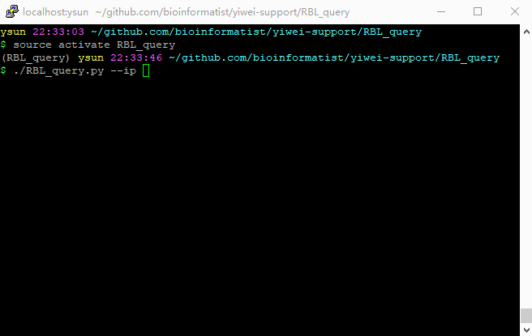

# RBL_query

`RBL_query.py`是一个RBL（Realtime Blackhole List）检查工具，可以用于确认邮件服务器的IP地址是否被加入各大反垃圾邮件组织的黑名单中。



## 环境配置

建议使用Anaconda解决依赖：

```bash
conda create -n RBL_query -c nsidc dnspython3
```

安装成功后，运行`source activate RBL_query`进入虚拟环境即可使用。

## 用法

使用`./RBL_query.py -h`可以查看使用方法：

```pre
Usage: RBL_query.py [options] arg

Options:
  -h, --help  show this help message and exit
  --ip=IP     待查询的IP地址
```