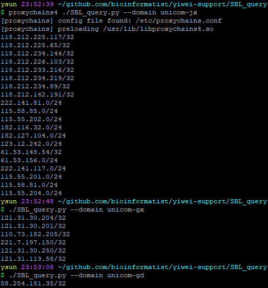

# SBL_query

`SBL_query.py`是一个SBL（Spamhaus Block List）检查工具，可以根据运营商的ISP Domain Name来查询当前运营商所有的IP是否有（某些）被列入黑名单。



**建议使用Anaconda**，程序使用的依赖均为Anaconda自带，无需额外安装。

## 用法

> 程序运行受网络环境影响，如果返回结果太慢，请尝试修改DNS或者使用代理。

使用`./SBL_query.py -h`可以查看使用方法：

```pre
Usage: SBL_query.py [options] arg

Options:
  -h, --help       show this help message and exit
  --domain=DOMAIN  待查询的ISP Domain Name
```