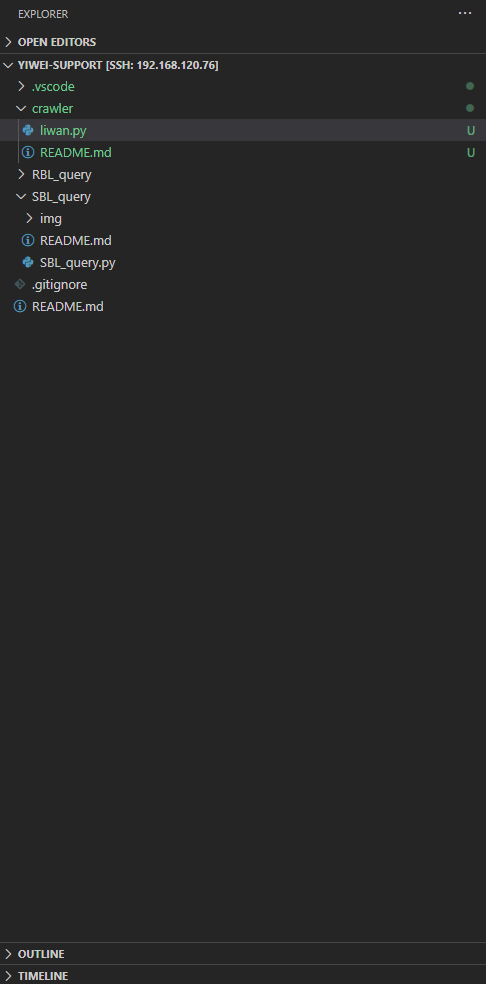

# 爬虫

妹妹考荔湾事业编，搞一个脚本把历年真题等爬下来，希望有用。



## 环境配置

Anaconda自带了bs4，所以只要装一个用来把HTML生成为MS word文档的pypandoc就好了。

```bash
pip install pypandoc --user
```

## 使用

运行命令：

```bash
./liwan.py
```

程序即在工作目录下生成一系列`.docx`文件，可直接用于打印复习用途。